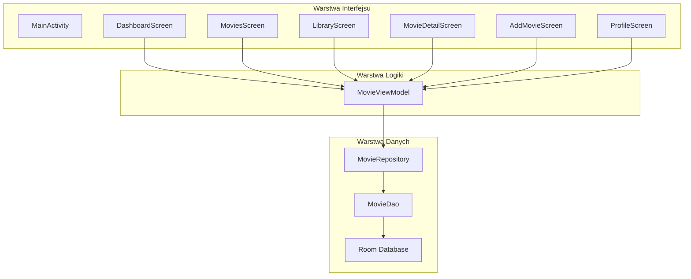
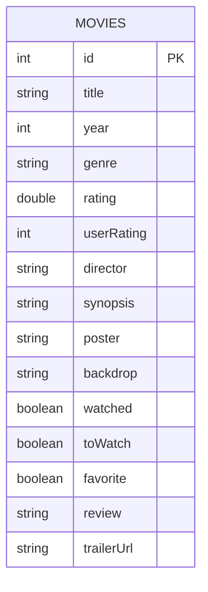

# 🎬 CineLog — Premiumowy Dziennik Filmowy


CineLog to natywna aplikacja mobilna na system Android służąca do zarządzania własną biblioteką filmów. Umożliwia dodawanie, ocenianie, recenzowanie oraz organizowanie filmów w przejrzysty sposób. Projekt został wykonany z wykorzystaniem nowoczesnych technologii Android, takich jak **Jetpack Compose**, **Room** oraz architektura **MVVM**.

---

# 🏗️ Architektura Systemu

Aplikacja została zbudowana zgodnie z architekturą **MVVM (Model-View-ViewModel)**, która rozdziela warstwę interfejsu użytkownika, logikę biznesową oraz warstwę danych.



### Przepływ danych

```text
UI
 ↓
MovieViewModel
 ↓
MovieRepository
 ↓
MovieDao
 ↓
Room (SQLite)
```

Dane wracają do interfejsu w przeciwnym kierunku za pomocą `Flow` oraz `StateFlow`, dzięki czemu ekrany automatycznie odświeżają się po zmianach w bazie danych.

---

# 🗺️ Mapa Ekranów

Aplikacja składa się z kilku głównych ekranów połączonych za pomocą Compose Navigation.

<p align="center">
  
</p>

## Główne ekrany

| Ekran | Opis |
|--------|--------|
| `DashboardScreen` | Ekran główny z wyróżnionym filmem, statystykami i ostatnio dodanymi pozycjami. |
| `MoviesScreen` | Przegląd wszystkich filmów wraz z wyszukiwarką, filtrowaniem i sortowaniem. |
| `MovieDetailScreen` | Szczegółowy widok filmu zawierający opis, ocenę, trailer i recenzję użytkownika. |
| `LibraryScreen` | Biblioteka użytkownika podzielona na filmy obejrzane, do obejrzenia i ulubione. |
| `AddMovieScreen` | Formularz dodawania nowego filmu. |
| `ProfileScreen` | Profil użytkownika wraz ze statystykami i wykresami. |

---

# 📊 Architektura Bazy Danych

Aplikacja wykorzystuje lokalną bazę danych **Room**, która jest warstwą abstrakcji nad SQLite.

## Model danych



## Struktura encji MovieEntity

| Pole | Typ | Opis |
|--------|--------|--------|
| id | Int | Unikalny identyfikator filmu |
| title | String | Tytuł filmu |
| year | Int | Rok premiery |
| genre | String | Gatunek filmu |
| rating | Double | Ogólna ocena filmu |
| userRating | Int | Ocena użytkownika |
| director | String | Reżyser |
| synopsis | String | Opis filmu |
| poster | String | URL lub nazwa plakatu |
| backdrop | String | URL lub nazwa tła |
| watched | Boolean | Czy film został obejrzany |
| toWatch | Boolean | Czy film znajduje się na liście do obejrzenia |
| favorite | Boolean | Czy film jest ulubiony |
| review | String | Recenzja użytkownika |
| trailerUrl | String | Źródło trailera |

---

# 🧠 Logika Aplikacji

Najważniejszym elementem logiki jest `MovieViewModel`.

Odpowiada on za:

- pobieranie danych z Repository,
- udostępnianie danych ekranom,
- dodawanie nowych filmów,
- aktualizowanie filmów,
- oznaczanie filmów jako obejrzane,
- dodawanie do ulubionych,
- dodawanie do listy „Do obejrzenia”,
- zapisywanie ocen i recenzji.

Przykładowy przepływ dodawania filmu:

```text
AddMovieScreen
    ↓
MovieEntity
    ↓
MovieViewModel.insert()
    ↓
MovieRepository
    ↓
MovieDao
    ↓
Room Database
```

---

# 🎨 Interfejs Użytkownika

Interfejs został wykonany w całości przy użyciu **Jetpack Compose**.

Projekt wykorzystuje:

- Material Design 3,
- ciemny motyw aplikacji,
- animacje Compose,
- karty filmów,
- wykresy statystyczne,
- responsywny układ ekranów.

## Komponenty wielokrotnego użytku

Folder:

```text
ui/components
```

zawiera wspólne komponenty używane przez wiele ekranów:

- `MovieGridItem`
- `MovieListItem`
- `FeaturedMovieCard`
- `StatCard`
- `StatMiniCard`
- `GenreBarChart`
- `RatingBarChart`

Dzięki temu kod jest bardziej modularny i łatwiejszy w utrzymaniu.

---

# 🎞️ Obsługa Trailerów i Multimediów

Aplikacja umożliwia odtwarzanie trailerów filmowych.

## Lokalne pliki MP4

Jeżeli:

```text
trailerUrl = "res/nazwa_trailera"
```

aplikacja wyszukuje plik w:

```text
res/raw/
```

i odtwarza go za pomocą:

```text
VideoView
```

## YouTube

Jeżeli `trailerUrl` zawiera link YouTube, aplikacja osadza film przy pomocy:

```text
WebView
```

oraz mechanizmu YouTube Embed.

## Obrazki

Plakaty i tła filmów mogą być:

- lokalnymi zasobami,
- adresami URL pobieranymi z internetu.

Do ich wyświetlania wykorzystywana jest biblioteka **Coil**.

---

# 🛠️ Wykorzystane Technologie

- Kotlin
- Jetpack Compose
- Material Design 3
- Room Database
- SQLite
- ViewModel
- Kotlin Coroutines
- Flow / StateFlow
- Compose Navigation
- Coil
- Android SDK 34
- JDK 17

---

# 🚀 Uruchomienie Projektu

## Wymagania

- Android Studio Ladybug lub nowsze
- JDK 17
- Android SDK 34

## Instalacja

1. Sklonuj repozytorium:

```bash
git clone https://github.com/patrykspace/Cine-log.git
```

2. Otwórz projekt w Android Studio.

3. Poczekaj na synchronizację Gradle.

4. Uruchom aplikację na emulatorze lub urządzeniu fizycznym.

## Pierwsze uruchomienie

Przy pierwszym uruchomieniu aplikacja:

1. Tworzy lokalną bazę Room.
2. Sprawdza, czy baza jest pusta.
3. Jeżeli jest pusta, uruchamia `DatabaseInitializer`.
4. Dodaje przykładowe filmy do bazy.
5. Wyświetla ekran główny aplikacji.

---

# 📂 Struktura Projektu

```text
com.cinelog
│
├── data
│   ├── AppDatabase
│   ├── MovieDao
│   ├── MovieEntity
│   ├── MovieRepository
│   └── DatabaseInitializer
│
├── viewmodel
│   └── MovieViewModel
│
└── ui
    ├── MainActivity
    ├── Screen
    ├── screens
    ├── components
    └── theme
```

---

# ❤️ Autorzy

Projekt został stworzony jako aplikacja do zarządzania własną biblioteką filmów z wykorzystaniem nowoczesnych technologii Android i architektury MVVM.
