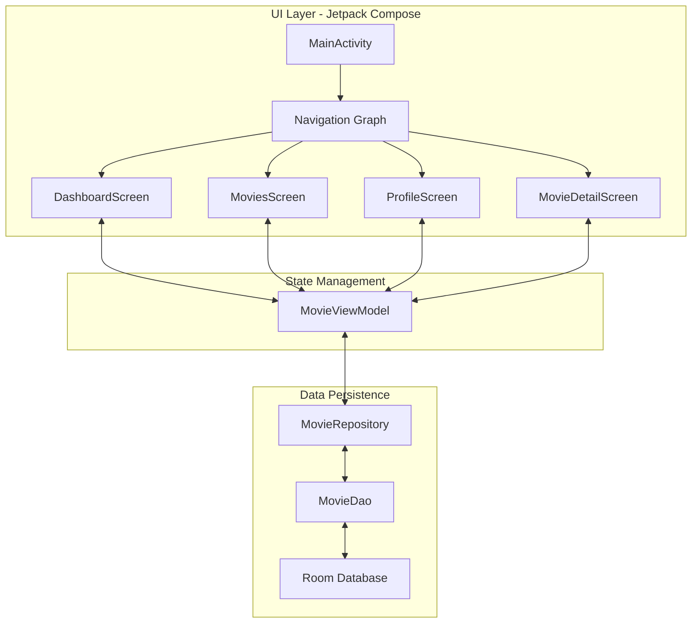
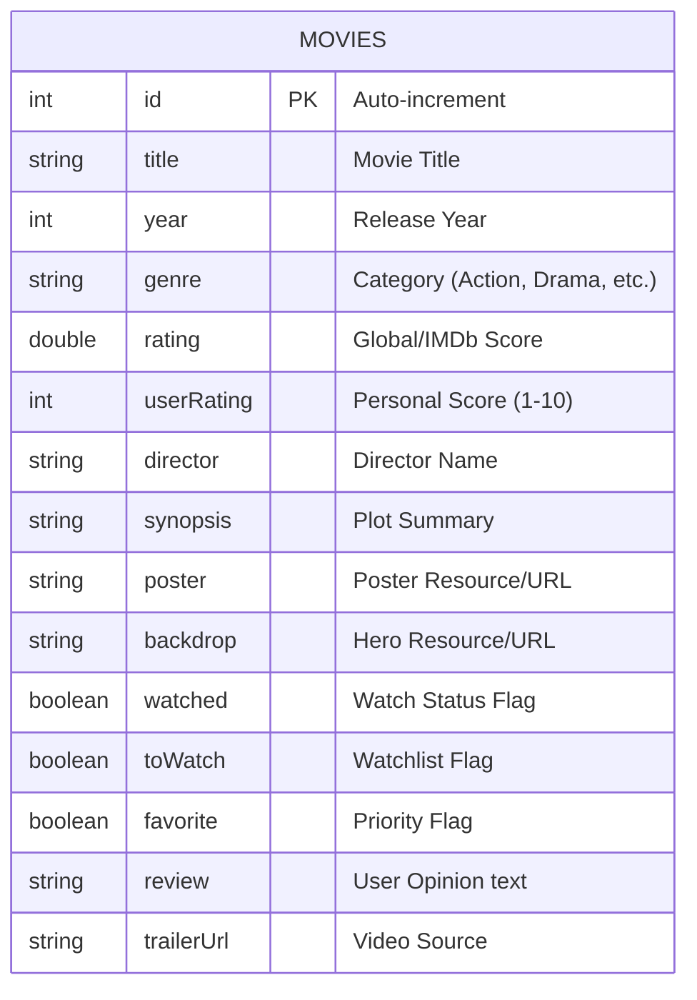

# 🎬 CineLog — Premium Movie Journal

CineLog is a professional, native Android application designed for high-end movie tracking. Built with a **Dark & Gold** premium aesthetic, it combines modern reactive programming with a sleek user experience.

---

## 🏗️ System Architecture

CineLog follows the **Clean Architecture** principles using the **MVVM (Model-View-ViewModel)** pattern. This ensures a strict separation of concerns, high testability, and a robust data flow.

### Key Architectural Pillars:
- **Reactive Streams**: Using `Kotlin Flow` and `StateFlow` for real-time UI updates.
- **Dependency Injection**: Constructor-based injection for the Repository and DAO.
- **Declarative UI**: 100% Jetpack Compose implementation with reusable stateless components.

---

## 📊 Database Architecture

The application utilizes a high-performance **Room Persistence Library** (SQLite abstraction). The schema is designed for quick metadata retrieval and efficient filtering.

### Entity Relationship Diagram (ERD)

### Data Schema Definition

| Field | Type | Constraint | Purpose |
| :--- | :--- | :--- | :--- |
| `id` | `Int` | `PRIMARY KEY` | Unique identifier for each entry. |
| `title` | `String` | `NOT NULL` | The primary display name. |
| `year` | `Int` | `DEFAULT 2024` | Temporal categorization. |
| `genre` | `String` | `INDEXED` | Facilitates multi-genre filtering. |
| `rating` | `Double` | `RANGE 0-10` | Reference quality score. |
| `userRating` | `Int` | `OPTIONAL` | Personalized qualitative metric. |
| `watched` | `Boolean` | `STATE` | Binary state for archive management. |
| `backdrop` | `String` | `URL/PATH` | Asset for immersive Hero UI components. |

---

## 🎨 UI/UX Philosophy

The interface is driven by a **Dark & Gold** design system, utilizing glassmorphism and high-contrast typography to create a "Cinematic Premium" feel.

### Component System
Located in `com.cinelog.ui.components`, our design system is modular:
- **`StatsComponents`**: Dynamic charts (Genre/Rating distributions) and Stat Cards.
- **`MovieComponents`**: Standardized cards (`MovieGridItem`, `MovieListItem`) and consistent headers.
- **Animations**: Leveraging `Crossfade` and `AnimatedVisibility` for fluid transitions.

---

## 🛠️ Technology Stack

- **Language**: Kotlin 1.9+
- **Asynchrony**: Coroutines, Flow, StateFlow.
- **Local DB**: Room (SQLite) - Version 8.
- **Image Engine**: Coil (with crossfade and error handling).
- **Navigation**: Compose Navigation with Type-Safe routes.
- **Video**: Internal Player with Hardware Acceleration.

---

## 🚀 Getting Started

1. **Prerequisites**: Android Studio Ladybug | JDK 17.
2. **Build**: Synced with Gradle 8.13.
3. **Seed**: The database automatically seeds with high-quality entries on first launch via `DatabaseInitializer`.

---

Developed with ❤️ for the Cinema Community.
