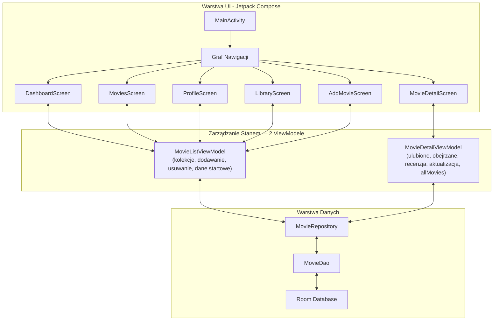
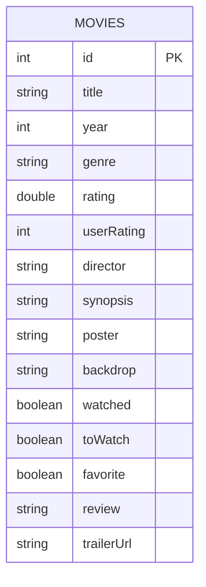

# 🎬 CineLog — Premiumowy Dziennik Filmowy


CineLog to natywna aplikacja mobilna na system Android służąca do zarządzania własną biblioteką filmów. Umożliwia dodawanie, ocenianie, recenzowanie oraz organizowanie filmów w przejrzysty sposób. Projekt został wykonany z wykorzystaniem nowoczesnych technologii Android, takich jak **Jetpack Compose**, **Room Database**, **Kotlin Coroutines** oraz architektura **MVVM**.

---

# 🏗️ Architektura Systemu

CineLog opiera się na zasadach **Clean Architecture** oraz wzorcu **MVVM (Model-View-ViewModel)**. Projekt wykorzystuje **dwa dedykowane ViewModele**, aby zachować wyraźny podział odpowiedzialności, wysoką testowalność oraz stabilny przepływ danych.



### Odpowiedzialności ViewModeli

| ViewModel | Odpowiedzialność | Używany przez |
| :--- | :--- | :--- |
| `MovieListViewModel` | Kolekcje filmów (`allMovies`, `watchedMovies`, `toWatchMovies`, `favoriteMovies`), `insert()`, `delete()`, inicjalizacja bazy przykładowymi danymi oraz poprawki obrazów. | Dashboard, Movies, Library, Profile, AddMovie |
| `MovieDetailViewModel` | Operacje na pojedynczym filmie i jego wyszukiwanie (`allMovies`, `toggleFavorite()`, `toggleWatched()`, `addToWatch()`, `removeFromWatch()`, `saveReview()`, `update()`). | MovieDetail |

# 🗺️ Mapa Ekranów

Aplikacja składa się z kilku głównych ekranów połączonych za pomocą Compose Navigation.

<p align="center">
  
</p>

## Główne ekrany

| Ekran | Opis |
|---------|---------|
| `DashboardScreen` | Ekran główny z wyróżnionym filmem, statystykami i ostatnio dodanymi pozycjami. |
| `MoviesScreen` | Przegląd wszystkich filmów wraz z wyszukiwarką, filtrowaniem i sortowaniem. |
| `MovieDetailScreen` | Szczegółowy widok filmu zawierający opis, ocenę, trailer i recenzję użytkownika. |
| `LibraryScreen` | Biblioteka użytkownika podzielona na filmy obejrzane, do obejrzenia i ulubione. |
| `AddMovieScreen` | Formularz dodawania nowego filmu. |
| `ProfileScreen` | Profil użytkownika wraz ze statystykami i wykresami. |

---

# 🧭 Nawigacja

Aplikacja wykorzystuje **Jetpack Compose Navigation**.

Główne trasy:

- DashboardScreen
- MoviesScreen
- LibraryScreen
- ProfileScreen
- AddMovieScreen
- MovieDetailScreen

W aktualnej wersji zastosowano:

- `launchSingleTop`
- `restoreState`
- `popUpTo`

co zapobiega tworzeniu wielu kopii tych samych ekranów w stosie nawigacji oraz pozwala zachować stan zakładek podczas przechodzenia pomiędzy ekranami.

---

# 📊 Architektura Bazy Danych

Aplikacja wykorzystuje lokalną bazę danych **Room**, która jest warstwą abstrakcji nad SQLite.

## Model danych



## Struktura encji MovieEntity

| Pole | Typ | Opis |
|---------|---------|---------|
| id | Int | Unikalny identyfikator filmu |
| title | String | Tytuł filmu |
| year | Int | Rok premiery |
| genre | String | Gatunek filmu |
| rating | Double | Ogólna ocena filmu |
| userRating | Int | Ocena użytkownika |
| director | String | Reżyser |
| synopsis | String | Opis filmu |
| poster | String | URL lub nazwa plakatu |
| backdrop | String | URL lub nazwa tła |
| watched | Boolean | Czy film został obejrzany |
| toWatch | Boolean | Czy film znajduje się na liście do obejrzenia |
| favorite | Boolean | Czy film jest ulubiony |
| review | String | Recenzja użytkownika |
| trailerUrl | String | Źródło trailera |

---

# 🧠 Logika Aplikacji

Aktualna wersja projektu wykorzystuje dwa niezależne ViewModele, dzięki czemu logika zarządzania listami filmów została oddzielona od logiki szczegółów filmu.

## MovieListViewModel

Odpowiada za:

- pobieranie wszystkich filmów,
- zarządzanie listą obejrzanych filmów,
- zarządzanie ulubionymi filmami,
- zarządzanie listą „Do obejrzenia”,
- dodawanie nowych filmów,
- usuwanie filmów,
- resetowanie bazy danych,
- inicjalizację przykładowych danych przy pierwszym uruchomieniu aplikacji.

Udostępnia między innymi:

```text
allMovies
watchedMovies
favoriteMovies
toWatchMovies
```

## MovieDetailViewModel

Odpowiada za:

- oznaczanie filmów jako obejrzane,
- dodawanie do ulubionych,
- dodawanie do listy „Do obejrzenia”,
- zapisywanie ocen użytkownika,
- zapisywanie recenzji.

Dzięki temu każdy ViewModel posiada jedną odpowiedzialność i jest łatwiejszy w utrzymaniu.

### Przykładowy przepływ dodawania filmu

```text
AddMovieScreen
    ↓
MovieEntity
    ↓
MovieListViewModel.insert()
    ↓
MovieRepository
    ↓
MovieDao
    ↓
Room Database
```

---

# 🎨 Interfejs Użytkownika

Interfejs został wykonany w całości przy użyciu **Jetpack Compose**.

Projekt wykorzystuje:

- Material Design 3,
- ciemny motyw aplikacji,
- animacje Compose,
- karty filmów,
- wykresy statystyczne,
- responsywny układ ekranów.

## Komponenty wielokrotnego użytku

Folder:

```text
ui/components
```

zawiera wspólne komponenty używane przez wiele ekranów:

- `MovieGridItem`
- `MovieListItem`
- `FeaturedMovieCard`
- `StatCard`
- `StatMiniCard`
- `GenreBarChart`
- `RatingBarChart`

Dzięki temu kod jest bardziej modularny i łatwiejszy w utrzymaniu.

---

# 🎞️ Obsługa Trailerów i Multimediów

Aplikacja umożliwia odtwarzanie trailerów filmowych oraz wyświetlanie plakatów i teł filmów.

## Lokalne pliki MP4

Jeżeli:

```text
trailerUrl = "res/nazwa_trailera"
```

aplikacja wyszukuje plik w:

```text
res/raw/
```

i odtwarza go za pomocą:

```text
VideoView
```

Schemat działania:

```text
MovieEntity.trailerUrl
        ↓
res/raw/*.mp4
        ↓
VideoView
```

---

## YouTube

Jeżeli `trailerUrl` zawiera link YouTube, aplikacja:

1. pobiera identyfikator filmu,
2. tworzy adres embed,
3. wyświetla trailer przy pomocy `WebView`.

Schemat działania:

```text
YouTube URL
     ↓
Embed URL
     ↓
WebView
```

---

## Obrazki

Plakaty i tła filmów mogą być:

- lokalnymi zasobami,
- adresami URL pobieranymi z internetu.

Do ich wyświetlania wykorzystywana jest biblioteka **Coil**.

Przykładowy kod:

```kotlin
AsyncImage(
    model = movie.poster,
    contentDescription = movie.title
)
```

Biblioteka Coil automatycznie:

- pobiera obraz z internetu,
- zapisuje go w pamięci podręcznej,
- wyświetla go w interfejsie użytkownika.

Dzięki temu aplikacja nie musi przechowywać większości obrazów lokalnie.

---

# 🛠️ Wykorzystane Technologie

### Język programowania

- Kotlin

### Interfejs użytkownika

- Jetpack Compose
- Material Design 3

### Baza danych

- Room Database
- SQLite

### Architektura

- MVVM
- Repository Pattern

### Programowanie asynchroniczne

- Kotlin Coroutines
- Flow
- StateFlow

### Nawigacja

- Jetpack Compose Navigation

### Multimedia

- Coil
- Android VideoView
- Android WebView

### Narzędzia

- Android Studio
- Gradle
- JDK 17
- Android SDK 34

---

# 🚀 Uruchomienie Projektu

## Wymagania

- Android Studio Ladybug lub nowsze
- JDK 17
- Android SDK 34

## Instalacja

1. Sklonuj repozytorium:

```bash
git clone https://github.com/patrykspace/Cine-log.git
```

2. Otwórz projekt w Android Studio.

3. Poczekaj na synchronizację Gradle.

4. Uruchom aplikację na emulatorze lub urządzeniu fizycznym.

---

## Pierwsze uruchomienie

Przy pierwszym uruchomieniu aplikacja:

1. Tworzy lokalną bazę Room.
2. Sprawdza, czy baza zawiera filmy.
3. Jeżeli baza jest pusta, uruchamia `DatabaseInitializer`.
4. Dodaje przykładowe rekordy filmów.
5. Aktualizuje wybrane plakaty i tła filmów.
6. Wyświetla ekran główny aplikacji.

Dzięki temu użytkownik od razu otrzymuje gotową bibliotekę filmów.

---

# 📂 Struktura Projektu

```text
com.cinelog
│
├── data
│   ├── AppDatabase
│   ├── MovieDao
│   ├── MovieEntity
│   ├── MovieRepository
│   └── DatabaseInitializer
│
├── viewmodel
│   ├── MovieListViewModel
│   └── MovieDetailViewModel
│
└── ui
    ├── MainActivity
    ├── Screen
    ├── screens
    ├── components
    └── theme
```

---

# ❤️ Autorzy

Projekt został stworzony jako aplikacja do zarządzania własną biblioteką filmów z wykorzystaniem nowoczesnych technologii Android oraz architektury MVVM.
